## 0 [Task](https://github.com/netology-code/fops-sysadm-diplom/blob/main/README.md) :warning:

## 1 Deploy infrastructure via Terraform :fast_forward:

```
cd terraform
terraform init
terraform fmt
terraform validate
terraform plan
terraform apply -auto-approve
```

## 2 Install packages via Ansible Playbook :fast_forward:
```
cd ..
cd ansible
ansible-playbook -i hosts.ini playbook.yaml
```

## 3 Deploy web server, application and exporters :fast_forward:
```
# download and run app
docker login
docker pull fox4kids/myrepo:currency
```

```
# Create docker-compose file with our APP, nginx and node exporter services
sudo tee docker-compose.yaml > /dev/null <<'EOF'
services:
  app:
    image: fox4kids/myrepo:currency
    container_name: currency
    ports:
      - 5000:5000
    restart: unless-stopped

  nginxlog-exporter:
    image: quay.io/martinhelmich/prometheus-nginxlog-exporter:v1.11.0
    container_name: nginxlog-exporter
    command:
      - "--config-file=/etc/nginxlog-exporter/config.hcl"
    volumes:
      - /var/log/nginx/:/mnt/nginxlogs:ro
      - ./nginxlog-exporter.hcl:/etc/nginxlog-exporter/config.hcl:ro
    ports:
      - 4040:4040
    restart: unless-stopped

  node_exporter:
    image: quay.io/prometheus/node-exporter:latest
    container_name: node_exporter
    network_mode: host
    pid: host
    restart: unless-stopped
    volumes:
      - '/:/host:ro,rslave'
    command:
      - '--path.rootfs=/host'
      - '--collector.cpu'
      - '--collector.meminfo'
      - '--collector.diskstats'
      - '--collector.filesystem'
      - '--collector.netdev'
      - '--collector.loadavg'
      - '--collector.time'
      - '--collector.systemd'
EOF

sudo docker compose up -d
```

```
# nginxlog-exporter config
sudo tee nginxlog-exporter.hcl > /dev/null <<'EOF'
listen {
  port = 4040
}

namespace "nginx" {
  source = {
    files = ["/mnt/nginxlogs/access.log"]
  }

  format = "$remote_addr - $remote_user [$time_local] \"$request\" $status $body_bytes_sent \"$http_referer\" \"$http_user_agent\""

  labels {
    app = "my-currency-app"
  }

  metrics {
    counter {
      name = "http_requests_total"
      help = "Total number of HTTP requests"
    }

    histogram {
      name = "http_response_size_bytes"
      help = "HTTP response size in bytes"
      value = "$body_bytes_sent"
      buckets = [100, 500, 1000, 5000, 10000, 50000, 100000]
    }
  }
}
EOF
```

```
# add nginx config for redirection traffic to APP
sudo tee /etc/nginx/sites-available/my-app > /dev/null <<'EOF'
server {
    listen 80;

    location / {
        proxy_pass http://127.0.0.1:5000;
        proxy_set_header Host $host;
        proxy_set_header X-Real-IP $remote_addr;
        proxy_set_header X-Forwarded-For $proxy_add_x_forwarded_for;
        proxy_set_header X-Forwarded-Proto $scheme;
    }
}
EOF

sudo ln -s /etc/nginx/sites-available/my-app /etc/nginx/sites-enabled/my-app
sudo rm /etc/nginx/sites-enabled/default
sudo nginx -t
sudo systemctl restart nginx
```

## 4 Deploy Prometheus :fast_forward:
```
# prometheus config
mkdir -p ~/prometheus
sudo tee ~/prometheus/prometheus.yml > /dev/null <<'EOF'
global:
  scrape_interval: 15s
  evaluation_interval: 15s

scrape_configs:
  - job_name: 'node_exporters'
    static_configs:
      - targets:
          - '10.0.10.35:9100'  # app1
          - '10.0.20.12:9100'  # app2

  - job_name: 'nginx_log_exporters'
    metrics_path: '/metrics'
    static_configs:
      - targets:
          - '10.0.10.35:4040'  # app1
          - '10.0.20.12:4040'  # app2
EOF
```

```
# prometheus docker-compose
sudo tee docker-compose.yaml > /dev/null <<'EOF'
services:
  prometheus:
    image: prom/prometheus:v3.3.0
    container_name: prometheus
    volumes: 
      - ./prometheus:/etc/prometheus/
      -  prometheus-data:/prometheus
    ports:
      - 9090:9090
    restart: unless-stopped
volumes:
   prometheus-data:
EOF

sudo docker compose up -d
```

## 5 Deploy Grafana :fast_forward:
```
sudo tee docker-compose.yaml > /dev/null <<'EOF'
services:
  grafana:
    image: grafana/grafana:11.6.1
    container_name: grafana
    volumes:
      - grafana-data:/grafana
    ports:
      - 80:3000
    restart: unless-stopped
volumes:
   grafana-data:
EOF

sudo docker compose up -d
```

## 6 Deploy Elasticsearch :fast_forward:
```
mkdir -p ./elasticsearch-data
sudo chown -R 1000:1000 ./elasticsearch-data
sudo chmod -R 770 ./elasticsearch-data

sudo tee docker-compose.yaml > /dev/null <<'EOF'
services:
  elasticsearch:
    image: elasticsearch:9.1.5
    container_name: elasticsearch
    environment:
      - cluster.name="my-elk-cluster"
      - xpack.security.enabled=false
      - discovery.type=single-node
      - ES_JAVA_OPTS=-Xms2g -Xmx2g
    mem_limit: 4g
    volumes:
      - "./elasticsearch-data:/usr/share/elasticsearch/data"
    ports:
      - 9200:9200
    restart: unless-stopped
EOF

sudo docker compose up -d
```

## 7 Deploy Filebeat :fast_forward:
```
sudo tee filebeat.yml > /dev/null <<'EOF'
filebeat.inputs:
 - type: filestream
   enabled: true
   id: my-nginx-logs
   paths:
     - /var/log/nginx/*.log

processors:
  - drop_event:
      when:
        contains:
          message: "YC-Healthcheck"

output.elasticsearch:
  hosts: ["10.0.10.3:9200"]
  indices:
    - index: "log-nginx-%{+yyyy.MM.dd}"
EOF
```

```
sudo tee docker-compose.yaml > /dev/null <<'EOF'
services:
  filebeat:
    container_name: filebeat
    image: elastic/filebeat:9.1.5
    command: --strict.perms=false
    volumes:
      - "./filebeat.yml:/usr/share/filebeat/filebeat.yml:ro"
      - "/var/log/nginx:/var/log/nginx:ro"
    restart: unless-stopped
EOF

sudo docker compose up -d
```

## 8 Deploy Kibana :fast_forward:
```
sudo tee docker-compose.yaml > /dev/null <<'EOF'
services:
  kibana:
    container_name: kibana
    image: kibana:9.1.5
    environment:
      - ELASTICSEARCH_HOSTS="http://10.0.10.3:9200"
    ports:
      - 5601:5601
    mem_limit: 1073741824
    restart: unless-stopped
EOF

sudo docker compose up -d
```

## Result :white_check_mark:

## 1 All Infrastructure
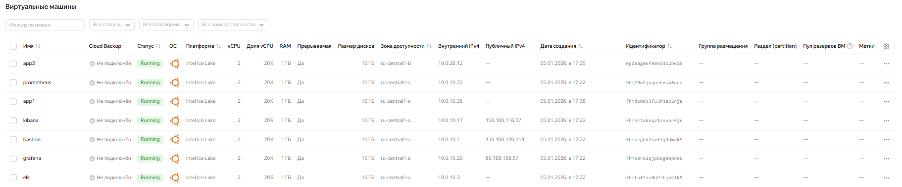

## 2 VPC
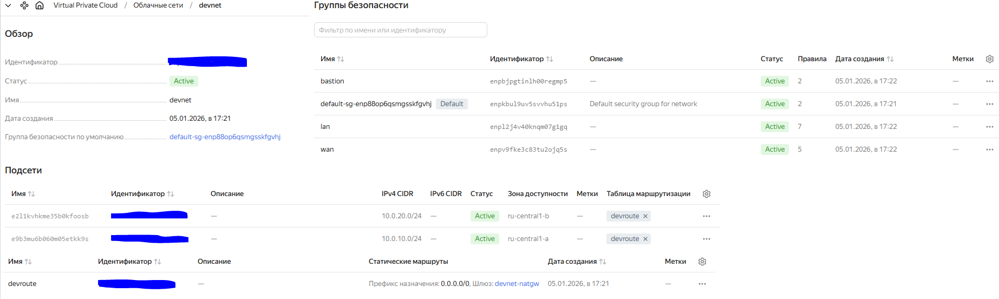

## 3 NLB
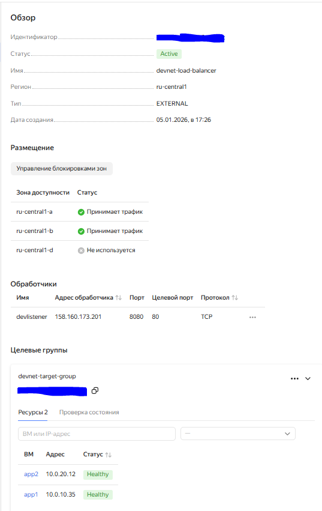

## 4 Install packages via Ansible
[Ansible](https://github.com/gantsevich-yuri/kurs-project/tree/main/ansible)

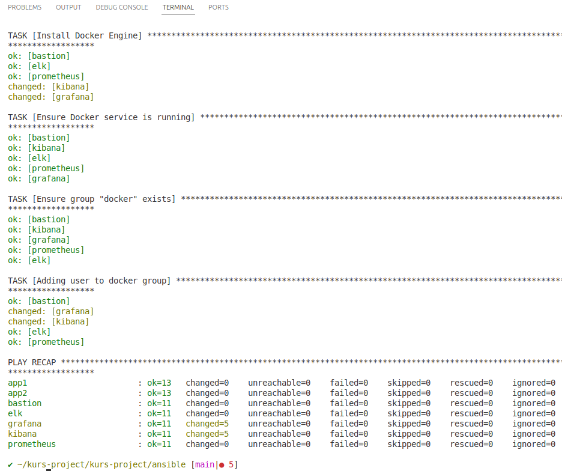

## 5 Connection via Bastion host
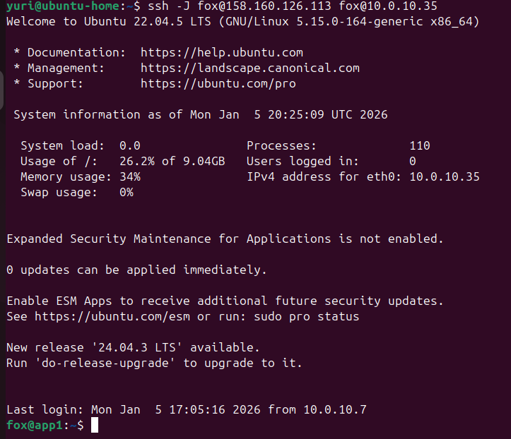

## 6 My App
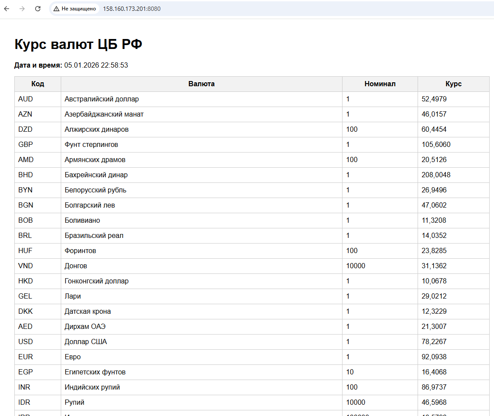

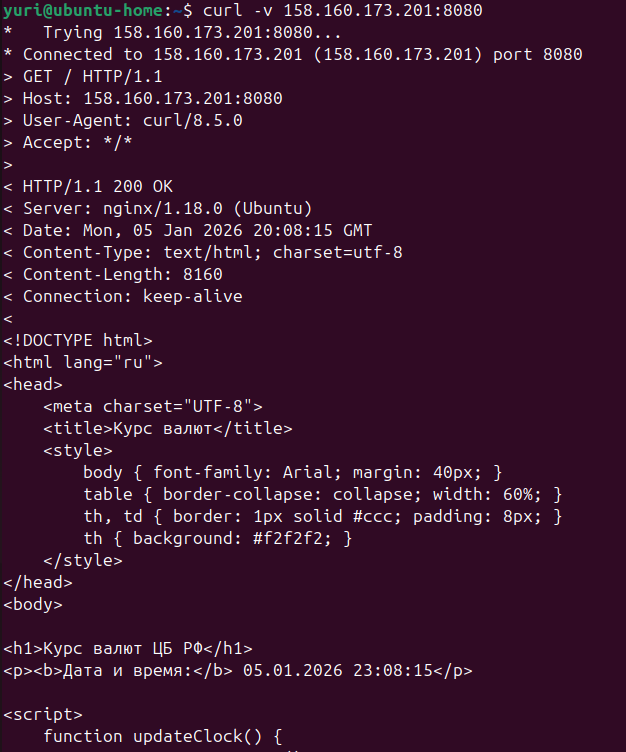

## 7 Monitoring
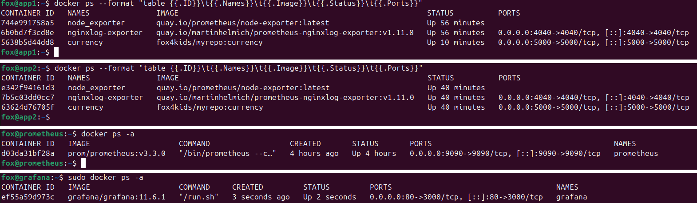

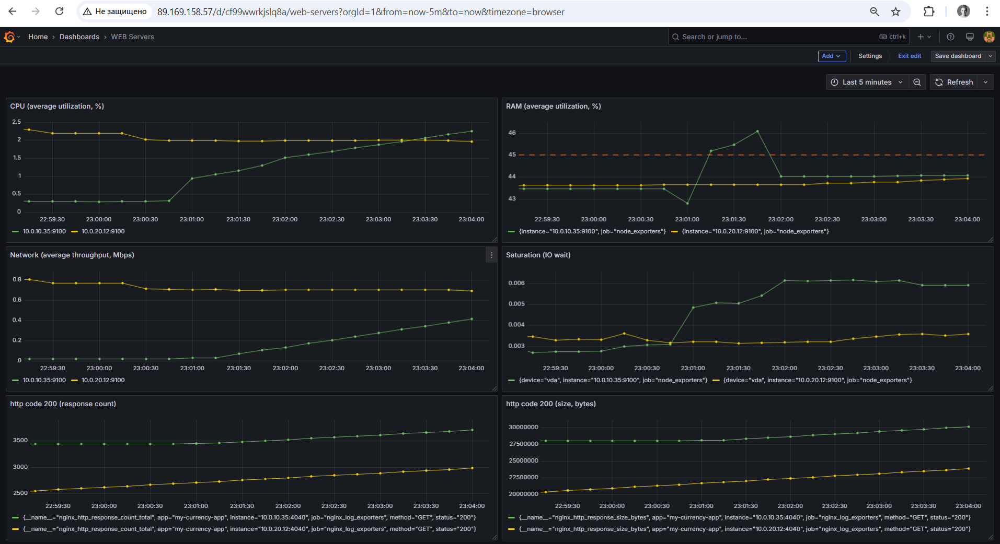

## 8 Logs
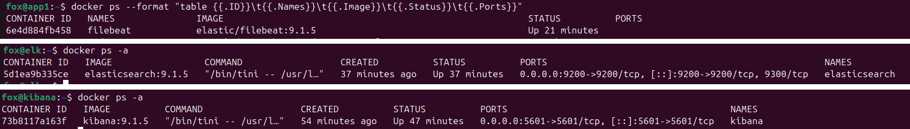

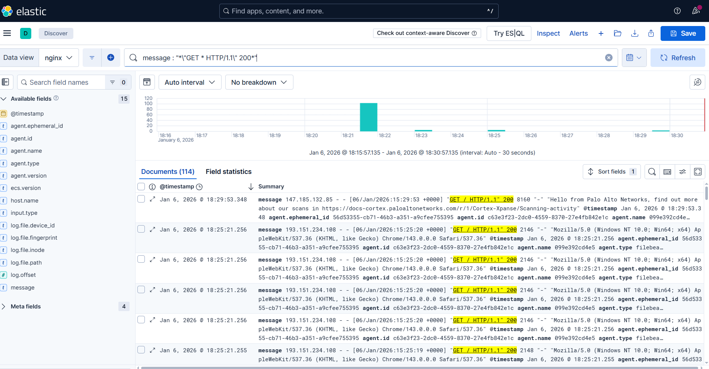

## 9 Snapshot
Via [Terraform](https://github.com/gantsevich-yuri/kurs-project/blob/main/terraform/snapshot.tf)

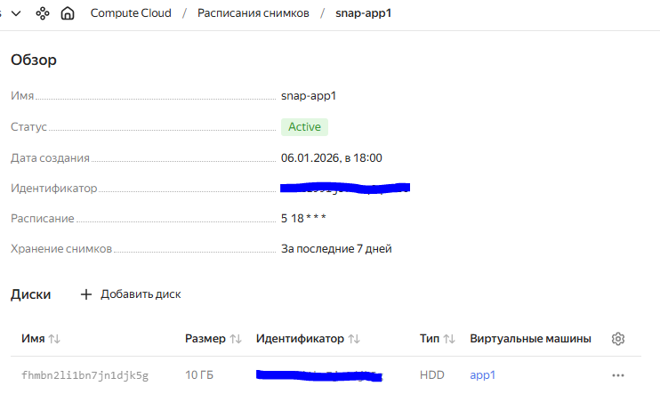